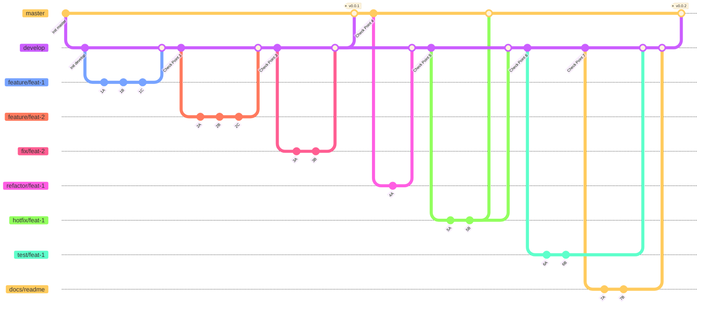

##### Contributor向けドキュメント

# ブランチルール 🌱

```mermaid
%%{init: { 'theme': 'base' } }%%
%%{init: {
 'gitGraph': { 'mainBranchName': 'master' }
} }%%

gitGraph
  commit id: "Init master"

  branch develop
  checkout develop
  commit id: "Init develop"

  branch feature/feat-1
  checkout feature/feat-1
  commit id: "1A"
  commit id: "1B"
  commit id: "1C"

  checkout develop
  merge feature/feat-1

  commit id: "Check Point 1"

  branch feature/feat-2
  checkout feature/feat-2
  commit id: "2A"
  commit id: "2B"
  commit id: "2C"

  checkout develop
  merge feature/feat-2

  commit id: "Check Point 3"

  branch fix/feat-2
  commit id: "3A"
  commit id: "3B"

  checkout develop
  merge fix/feat-2

  checkout master
  merge develop tag: "v0.0.1"

  commit id: "Check Point 4"

  branch refactor/feat-1
  checkout refactor/feat-1
  commit id: "4A"

  checkout develop
  merge refactor/feat-1
  commit id: "Check Point 5"

  branch hotfix/feat-1
  checkout hotfix/feat-1
  commit id: "5A"
  commit id: "5B"

  checkout master
  merge hotfix/feat-1
  checkout develop
  merge hotfix/feat-1

  commit id: "Check Point 6"

  branch test/feat-1
  checkout test/feat-1
  commit id: "6A"
  commit id: "6B"

  checkout develop
  commit id: "Check Point 7"

  branch docs/readme
  checkout docs/readme
  commit id: "7A"
  commit id: "7B"

  checkout develop
  merge test/feat-1
  merge docs/readme

  checkout master
  merge develop tag: "v0.0.2"
```
