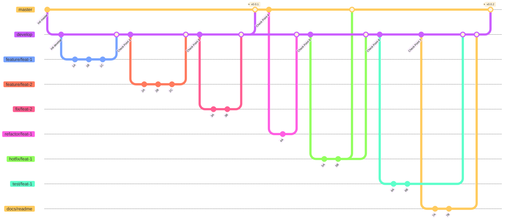

##### Contributor向けドキュメント

# ブランチルール 🌱



## 原則

マージするときは例外以外はローカルでマージするのではなくリモートでPull Requetsを通してマージしてください。

例外については`hotfix`ブランチから`develop`ブランチにマージする場合です。  
これが可能になる場面は、`hotfix`ブランチから`master`にPull Requestsを通して、マージされた場合Pull Requetsをマージした担当者が`hotfix`ブランチを`develop`ブランチにマージしてください。  
コンフリクトが発生した場合はそれまでの`develop`ブランチの貢献者と`Pull Requests`作成者と協力してコンフリクトを解消してください。

`git merge`コマンドを使ってマージしてはいけません。  
また`develop`ブランチにPull Requestsを通して、作成したブランチをマージした場合、GitHub Actionsが自動でリモートのブランチを削除します。  
リモートでマージ済みのブランチをローカルで削除するかは委任します。

## ブランチ一覧

### master

原則として`master`ブランチに直接コミットしないでください。

このブランチは`develop`及び`hotfix`ブランチからPull Requestsを通してマージされます。  
なお、このブランチは必ず動作するコードがコミットされます。  
デバッグ中のコード及び動かないコード等を含むブランチをマージしないでください。
また、`master`ブランチにマージする権限を持つものはリポジトリオーナーのみ可能です。

### develop

原則として`develop`ブランチに直接コミットしないでください。

このブランチは`feature`及び`fix`及び`test`及び`docs`及び`refactor`ブランチからPull Requestsを通してマージされます。  
このブランチには追加及び変更した機能が動作する状態でマージしてください。

### hotfix

原則として`hotfix`ブランチの命名規則は`hotfix/機能名`です。機能名は英語で記載してください。

`hotfix`ブランチは`master`ブランチにてすでに提供されているコードに早急に直すべきバグ及び脆弱性等が見つかった場合に作成及び使用するブランチです。

このブランチを作るときは以下のコマンドを実行してください。

```bash
git checkout -b hotfix/feat-name master
```

作成したらリモートにプッシュしてください。

```bash
git push --set-upstream origin hotfix/feat-name
```

このブランチでは自由に作業してもらって構いません。  
未完成のコードをコミットしても問題ないです。  
ただ、`master`にマージする場合は完成させてからPull Requestsを通してマージしてください。

### feature

原則として`feature`ブランチの命名規則は`feature/機能名`です。機能名は英語で記載してください。

`feature`ブランチは新機能を作成する場合に作成及び使用するブランチです。

このブランチを作るときは以下のコマンドを実行してください。

```bash
git checkout -b feature/feat-name develop
```

作成したらリモートにプッシュしてください。

```bash
git push --set-upstream origin feature/feat-name
```

このブランチでは自由に作業してもらって構いません。  
未完成のコードをコミットしても問題ないです。  
ただ、`develop`にマージする場合は完成させてからPull Requestsを通してマージしてください。

### fix

原則として`fix`ブランチの命名規則は`fix/機能名`です。機能名は英語で記載してください。

`fix`ブランチはバグや脆弱性等を修正する場合に作成及び使用するブランチです。

このブランチを作るときは以下のコマンドを実行してください。

```bash
git checkout -b fix/feat-name develop
```

作成したらリモートにプッシュしてください。

```bash
git push --set-upstream origin fix/feat-name
```

このブランチでは自由に作業してもらって構いません。  
未完成のコードをコミットしても問題ないです。  
た

### test

原則として`test`ブランチの命名規則は`test/機能名`です。機能名は英語で記載してください。

`test`ブランチは機能をテストする場合に作成及び使用するブランチです。

このブランチを作るときは以下のコマンドを実行してください。

```bash
git checkout -b test/feat-name develop
```

作成したらリモートにプッシュしてください。

```bash
git push --set-upstream origin test/feat-name
```

このブランチでは自由に作業してもらって構いません。  
未完成のコードをコミットしても問題ないです。  
ただ、`develop`にマージする場合は完成させてからPull Requestsを通してマージしてください。

### docs

原則として`docs`ブランチの命名規則は`docs/内容`です。内容名は内容を一言に要約したものを英語で記載してください。

`docs`ブランチはドキュメントを編集及び追加する場合に作成及び使用するブランチです。

このブランチを作るときは以下のコマンドを実行してください。

```bash
git checkout -b docs/feat-name develop
```

作成したらリモートにプッシュしてください。

```bash
git push --set-upstream origin docs/feat-name
```

このブランチでは自由に作業してもらって構いません。  
未完成のコードをコミットしても問題ないです。  
ただ、`develop`にマージする場合は完成させてからPull Requestsを通してマージしてください。
